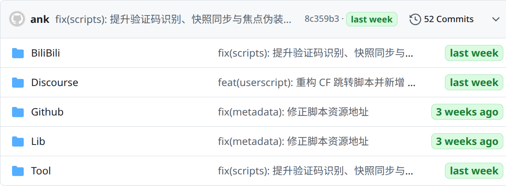

# Tampermonkey 脚本集

## 脚本展示

### Discourse Raw → Markdown Copier

为 Discourse 帖子提供 Raw / Markdown 复制与转换能力，适合整理帖文、迁移内容和二次发布。

### GitHub Toolbar Boost

为 GitHub 仓库顶部工具栏补充常用入口，例如 GitHub.dev、DeepWiki、CodeWiki、ZreadAi 等。

### GitHub Freshness

为仓库文件列表与时间组件添加“新鲜度”标签，快速识别近期活跃与陈旧内容。
